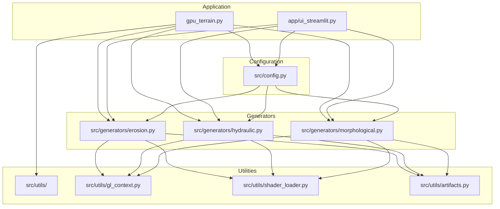
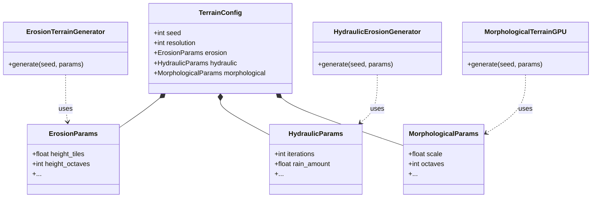

# Dependency Graph & Coupling Analysis

This document visualizes the current architectural dependencies and identifies coupling hotspots within the codebase.

## Module Dependency Graph

The following diagram illustrates the high-level dependencies between the core modules.

## Class Relationships

This diagram details how the configuration classes relate to the generator classes.

## Coupling Analysis

### 1. The "Config Hub" Pattern
**Severity: Medium**

`src/config.py` acts as a central hub that imports parameter definitions from all specific generator modules.

*   **The Issue**: `TerrainConfig` is tightly coupled to every specific generator implementation. To add a new generator, you must modify `src/config.py` to import the new params class and add a field to `TerrainConfig`.
*   **Impact**: Violates the Open/Closed Principle. The configuration module grows linearly with the number of generators.
*   **Recommendation**: Move towards a registry pattern or a generic configuration dictionary where generators register their own configuration schemas, or keep `TerrainConfig` as a high-level composition root but accept that it will change often.

### 2. Generator Independence
**Status: Healthy**

The generators (`ErosionTerrainGenerator`, `HydraulicErosionGenerator`, `MorphologicalTerrainGPU`) are well-isolated from each other.

*   **Observation**: They do not import each other. They share common dependencies only through `src/utils`.
*   **Benefit**: You can modify or delete one generator without affecting the others.

### 3. Utility Layer
**Status: Healthy**

The `src/utils` package provides essential services (Context creation, Shader loading, Data structures) without depending on the domain logic in `generators`.

*   **Observation**: `TerrainMaps` (in `artifacts.py`) acts as the common data exchange format (DTO), which is a good practice.
