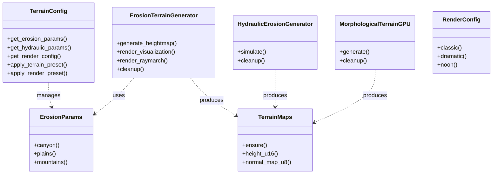

# Codebase Knowledge Graph

This document provides a structured view of the codebase entities, their relationships, and the overall architecture. It is generated from static analysis of the source code.

## Overview

*   **Project Root**: `d:\I_Drive_Backup\Projects\game_design\map_gen`
*   **Core Source**: `src/`
*   **Entry Points**: `gpu_terrain.py`, `app/ui_streamlit.py`
*   **Documentation**: `docs/`

## Class Hierarchy Diagram

The following diagram illustrates the key classes in the system and their methods.

## Key Modules & Entities

### Core Generators
*   **`src.generators.erosion`**: The primary terrain generator using fractal noise and thermal erosion.
    *   `ErosionTerrainGenerator`: Main class.
    *   `ErosionParams`: Configuration dataclass.
*   **`src.generators.hydraulic`**: Advanced hydraulic erosion simulation.
    *   `HydraulicErosionGenerator`: GPU-based pipe model simulation.
*   **`src.generators.morphological`**: Alternative generator using morphological operations.
    *   `MorphologicalTerrainGPU`: Voronoi and distance field based generation.

### Configuration
*   **`src.config`**: Central configuration management.
    *   `TerrainConfig`: The "God Object" for configuration, aggregating all params.

### Utilities
*   **`src.utils.gl_context`**: Manages ModernGL context creation (headless vs windowed).
*   **`src.utils.shader_loader`**: Loads GLSL shaders from the `src/shaders` directory.
*   **`src.utils.artifacts`**: Defines `TerrainMaps`, the standard data transfer object.
*   **`src.utils.rendering`**: CPU-side rendering helpers (Matplotlib/Pillow).
*   **`src.utils.advanced_rendering`**: Complex rendering tasks (turntables, lighting studies).

## Data Flow

1.  **Configuration**: User inputs -> `TerrainConfig` -> `*Params` objects.
2.  **Generation**: `*Params` -> `Generator` (GPU) -> `TerrainMaps` (NumPy/CPU).
3.  **Processing**: `TerrainMaps` -> `PostProcessing` / `HydraulicErosion`.
4.  **Output**: `TerrainMaps` -> `Export` (PNG/OBJ) or `Visualization` (Screen/Video).

## Raw Data

For a complete programmatic view of the codebase, refer to the JSON export:
*   [knowledge_graph.json](./knowledge_graph.json)
