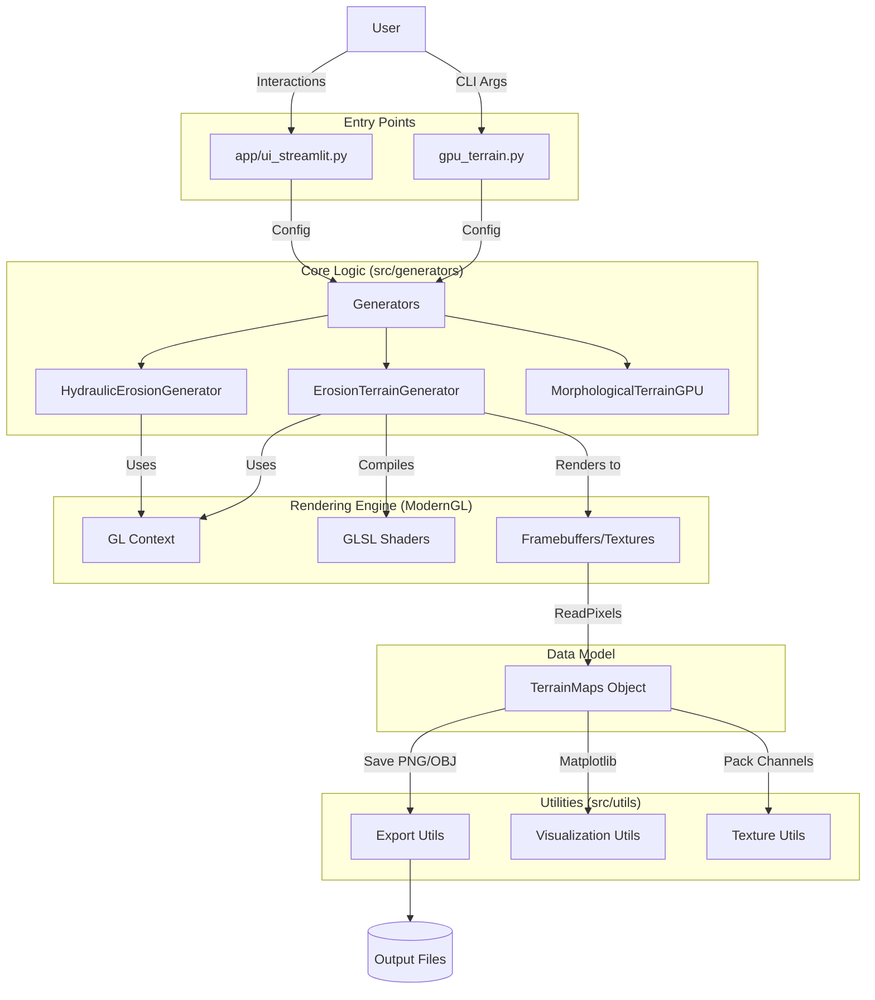
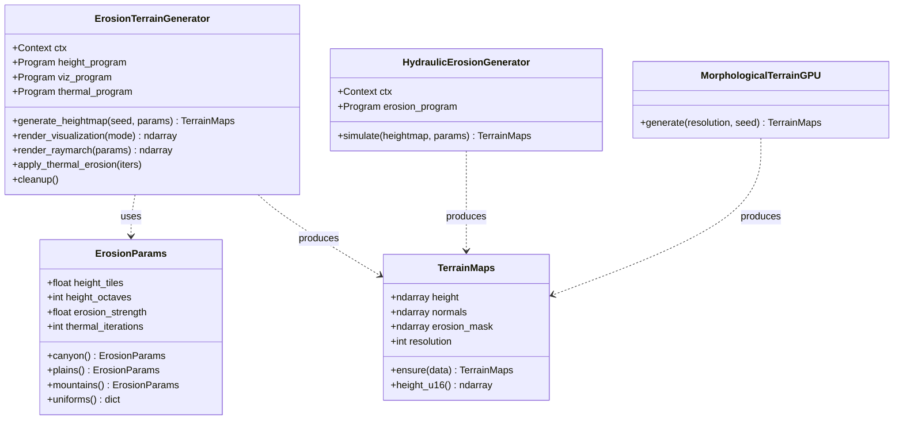
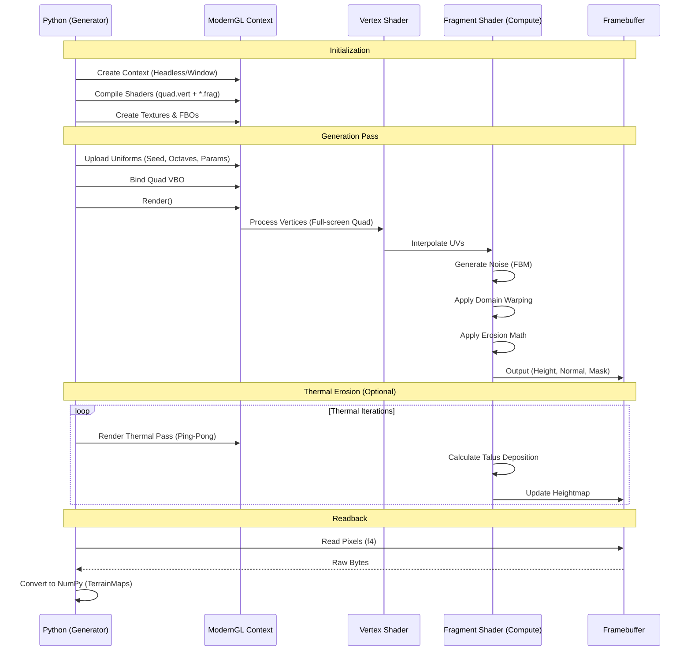
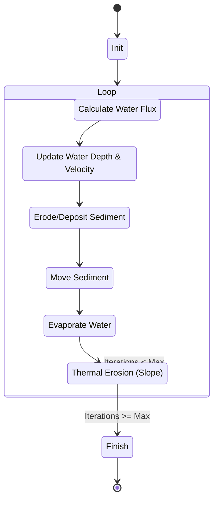
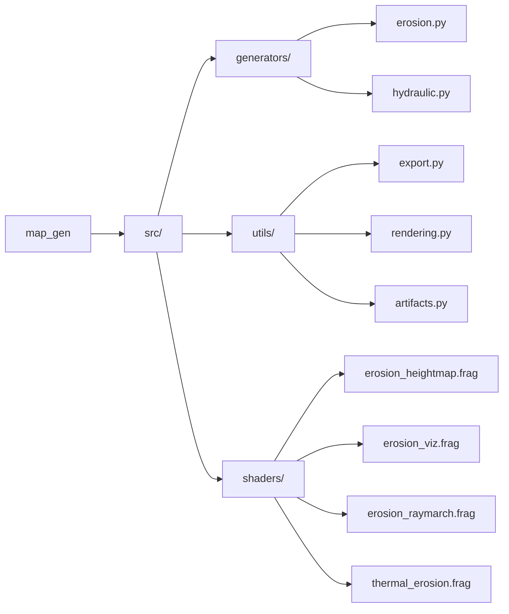

# System Architecture

This document provides a high-level overview of the `map_gen` system architecture, component relationships, and data flow.

## High-Level Architecture

The system is designed as a pipeline where configuration drives procedural generation on the GPU, resulting in data structures that can be exported or visualized.

## Class Structure

The core generation logic is encapsulated in generator classes that manage their own ModernGL resources. Data is passed around using the `TerrainMaps` data transfer object.

## GPU Generation Pipeline

The generation process relies heavily on the GPU. Python acts as the orchestrator, setting up the state and retrieving the results.

## Hydraulic Erosion Simulation Loop

The hydraulic erosion generator uses a complex iterative simulation loop to model water flow and sediment transport.

## Directory Structure

